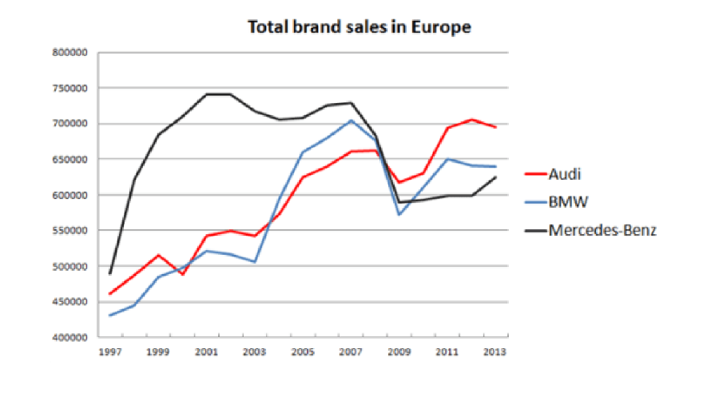
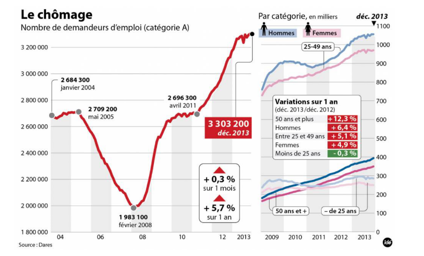
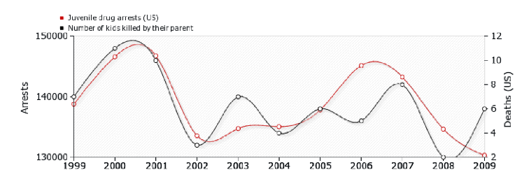

# Graphics Analysis - Jean Marc

We will conduct analysis on 3 graphs from slides, where we analyze how good those graphs are, following Jean-Marcs list as a guide for good graphics.

Here is the list:   
Data
- Nature of data: The graphic type (curve, bars, pie, etc.) must be adapted to the data.
- Approximations: Interpolations must make sense.
- Precision: Curves need a sufficient number of points.
- Method: The building method (linear, regression, etc.) must be clear.
- Intervals: Confidence intervals should be visualized or provided.
- Histograms: Steps must be adequate and visualize probabilities (0 to 1).

Graphical Objects
- Readability: Objects must be readable on screen, in B/W print, and on video.
- Colors: Use standard ranges; avoid too similar colors or green for video.
- Axes & Scales: Axes must be identified, labeled, and have explicit scales/units.
- Clarity: Curves should cross without ambiguity, and grids should help the reader.

Annotations
- Labeling: Axes must be labeled by quantities with clear, self-contained labels.
- Orientation: Units must be indicated; axes should go left-to-right and bottom-to-top.
- Origin: Use (0,0) unless a different origin is clearly justified.
- Continuity: There should be no "holes" on the axes.
- Ordering: Bar graphs should use logical ordering (alphabetical, temporal, etc.).
- Legends: Each curve and bar must have a legend.

Information
- Scale: Curves must be on the same scale.
- Density: Keep the number of curves small (less than 6).
- Comparison: Compare curves on the same graphic.
- Relevance: Every curve and object must be essential to the information provided.
- Error Bars: If the vertical axis shows averages, indicate error bars.

Context
- References: Define all symbols and reference the graphic/figure in the text.
- Efficiency: The graphic should be the most efficient representation for the data.
- Title: Must have a title that is sufficiently self-contained to be understood.

Commentary: The text must comment on the figure.

## 1. First Graph 

Data
- Nature of data: OK - The line graph is good for showing evolution over time.
- Approximations: OK - Interpolations appear linear, however, individual data points are not explicitly marked.
- Precision: OK - The curves appear smooth enough, suggesting enough data points.
- Method: MID - Appears to be linear interpolation but not explicitly stated.
- Intervals: NO - There are no confidence intervals shown for the data.
- Histograms: / - Not applicable

Graphical Objects
- Readability: MID - Lines are clear, but some colors (red, blue) might be difficult to distinguish in black & white. 
- Colors: OK - Standard colors used.
- Axes & Scales: MID - Numbers are clear, but there are no unit names.
- Clarity: OK - Crossings are clear, and grids help. 

Annotations
- Labeling: NO - No labels on the axes to say what the numbers mean.
- Orientation: OK - Years (we suppose) go left-to-right, numbers go bottom-to-top, but we don't have labels explaining the meaning
- Origin: NO - The Y-axis starts at 400,000 instead of 0.
- Continuity: OK - There are no gaps in the axes.
- Ordering: / - Not applicable
- Legends: OK - A clear legend identifies each car brand.

Information
- Scale: OK - All brands use the same scale.
- Density: OK - There are 3 curves (under the limit of 6).
- Comparison: OK - The three brands are easy to compare .
- Relevance: OK - Every line is necessary.
- Error Bars: NO - There are no error bars shown.

Context
- References: NO - No source is given for the sales data.
- Efficiency: MID - The graph is a good choice, but missing labels hurt efficiency.
- Title: MID - The title is clear but needs units (like "in millions").

Commentary: NO - There is no text explaining the figure.

Final Note: The graph is not elegant because it is missing axis labels and a zero origin.

## 2. Second Graph 

Here, we technically have 2 graphs, we will analyze both of them in the comments.

Data:
- Nature of data: OK - Line charts are the standard and correct choice for visualizing time-series evolution (unemployment over years).
- Approximations: OK - The lines connect data points directly without smoothing that would hide real fluctuations.
- Precision: : OK - The left curve is granular (likely monthly), showing clear seasonality and trends.
- Method: MID - The method is not explicitly stated, though it appears to be a direct plot of monthly data.
- Intervals: NO - There are no confidence intervals shown for the data.
- Histograms: NO - The vertical background stripes (zebra shading) look like a histogram/bar chart. This violates the rule that graphical objects must be "adapted to the data." It creates false patterns and confusion.

Graphical Objects
- Readability: MID - The main red line is clear, but the right-side graphs are very crowded with many overlapping lines and text boxes. 
- Colors: MID - The light blue and pink lines on the right might share similar grayscale values, making them hard to distinguish if printed in Black & White.
- Axes & Scales: MID - Scales are clear, but the vertical scale for the main graph is different from the breakdown graphs on the right.
- Clarity: NO - The graphic is quite "busy" with many annotations, which can distract from the data trends. The background stripes ("bars") add high-contrast noise that competes with the data curves. A simple grid would have been clearer without distracting the eye. Inconsistent formatting (like changing 08 to 2008 across two panels).

Annotations
- Labeling: NO - The format is inconsistent. The left graph uses short 2-digit years ("04", "06", "08"), while the right graphs use full 4-digit years ("2009", "2010"). Even worse, the left graph suddenly switches to "2013" at the very end, mixing formats on the same axis. 
- Orientation: OK - Standard left-to-right (time), bottom-to-top (counts).
- Origin: NO - The main graph starts at 1,800,000 without a clear visual justification or "break" symbol.
- Continuity: OK - There are no gaps in the axes.
- Ordering: / - Not applicable
- Legends: OK - The left plot needs no legend (title suffices). The right plots use icons (Men/Women) and direct labels/arrows for age groups.

Information
- Scale: MID - It is confusing. The main chart shows 10 years (2004–2013), but the small side charts only show 5 years (2009–2013).
- Density: NO - The "Variations" tables add too much density, hard to read.
- Comparison: OK - The curves are easy to compare.
- Relevance: NO - The percentage tables are not "essential" in this format, they clutter the visual flow. The growth could have been summarized in the text or a cleaner side-table.
- Error Bars: / - There are no error bars shown.

Context
- References: OK - The source ("Dares") is clearly written at the bottom left.
- Efficiency: OK - The graph is a good choice.
- Title: OK - The graphic has a title which is clear.

Commentary: OK - The text explains the trend.

## 3. Third Graph

Data:
- Nature of data: OK - Line charts are correct for time series.
- Approximations: NO - he lines use "curvy" interpolation. Real annual crime data is discrete; these smooth curves imply continuous trends that likely don't exist.
- Precision: : OK - Data points (circles) are clearly marked.
- Method: NO - There are two Y-Axes to force two unrelated datasets to look identical. This is not good methodology.
- Intervals: NO - There are no confidence intervals shown for the data.
- Histograms: / - Not applicable.

Graphical Objects
- Readability: MID - The text is small and pixelated.
- Colors: OK - Red vs. Black is high-contrast and easy to distinguish.
- Axes & Scales: NO - This is the biggest flaw. On left axis, range is ~130k to 150k. On right axis range is 2 to 12. The scales are manipulated arbitrarily to make the lines overlap.
- Clarity: NO - The dual axes make it difficult to know which line corresponds to which value.

Annotations
- Labeling: OK - Axes are labeled.
- Orientation: OK - Standard left-to-right (time), bottom-to-top (counts).
- Origin: NO - Neither axis starts at (0,0). Left starts at 130,000. Right starts at 2.
- Continuity: OK - There are no gaps in the axes.
- Ordering: / - Not applicable
- Legends: OK - The top-left legend is clear.

Information
- Scale: NO - The magnitude difference is massive (140,000 vs. 10), yet they are presented as equal.
- Density: OK - The graph only displays 2 curves (red and black), which is under 6.
- Comparison: NO - This compares two likely unrelated variables to imply a causal link (or just a coincidence). It is misleading.
- Relevance: NO - The two variables (Drug Arrests and Domestic Murders) have no proven logical or causal connection.
- Error Bars: / - There are no error bars shown.

Context
- References: NO - There is no source given.
- Efficiency: NO - Such graph is never a good choice.
- Title: NO - It lacks a descriptive title explaining the chart's intent.

Commentary: NO - There is no text explaining the graph.
