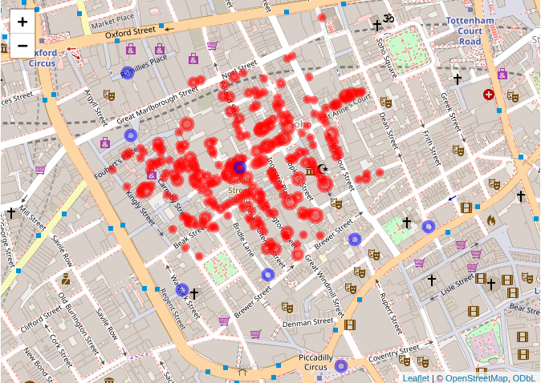

John Snow Cholera Analysis
================

# Introduction

In 1854, London’s Soho district suffered a severe cholera outbreak. Dr.
John Snow used mapping to identify a contaminated water pump as the
source.

## Libraries & Data Preparation

First, we load the necessary libraries and the data

``` r
library(sf)
library(leaflet)
library(leaflet.extras)
library(dplyr)


# Load Shapefiles and convert from British National Grid (meters)to WGS84 (GPS coordinates) so they align with the modern world map

deaths <- st_read("data/SnowGIS_SHP/Cholera_Deaths.shp")
```

    ## Reading layer `Cholera_Deaths' from data source 
    ##   `/home/masa/Documents/ENSIMAG/SMPE/SMPE-2025-2026-M2AI/PeerEvaluation/data/SnowGIS_SHP/Cholera_Deaths.shp' 
    ##   using driver `ESRI Shapefile'
    ## Simple feature collection with 250 features and 2 fields
    ## Geometry type: POINT
    ## Dimension:     XY
    ## Bounding box:  xmin: 529160.3 ymin: 180857.9 xmax: 529655.9 ymax: 181306.2
    ## Projected CRS: OSGB36 / British National Grid

``` r
pumps <- st_read("data/SnowGIS_SHP/Pumps.shp")
```

    ## Reading layer `Pumps' from data source 
    ##   `/home/masa/Documents/ENSIMAG/SMPE/SMPE-2025-2026-M2AI/PeerEvaluation/data/SnowGIS_SHP/Pumps.shp' 
    ##   using driver `ESRI Shapefile'
    ## Simple feature collection with 8 features and 1 field
    ## Geometry type: POINT
    ## Dimension:     XY
    ## Bounding box:  xmin: 529183.7 ymin: 180660.5 xmax: 529748.9 ymax: 181193.7
    ## Projected CRS: OSGB36 / British National Grid

``` r
deaths <- st_transform(deaths, 4326 )
pumps <- st_transform(pumps, 4326)
```

## Mission 1: Proportional Symbol Map

This map replicates Snow’s original visualization. The size of the red
circles represents the number of deaths at each location.

``` r
# Circle radius is scaled by the square root of death count for visual accuracy
leaflet() %>%
  addTiles() %>%
  addCircleMarkers(data = deaths, 
                   radius = ~sqrt(Count) * 3, 
                   color = "red", 
                   fillOpacity = 0.5,
                   label = ~paste("Deaths:", Count)) %>%
  addCircleMarkers(data = pumps, 
                   color = "blue", 
                   radius = 6, 
                   label = "Public Water Pump")
```

<!-- -->


## Mission 2: Density Analysis

The heatmap below shows the “hot zone” of the epidemic, clearly
centering on the Broad Street pump.

``` r
# Use a Heatmap to prove the Broad Street pump is the outbreak's center
# This highlights the 'hot zone' where the concentration of deaths is highest
leaflet() %>%
  addTiles() %>%
  addHeatmap(data = deaths, intensity = ~Count, blur = 20, radius = 15) %>%
  addCircleMarkers(data = pumps, color = "blue", radius = 5, label = "Pump")
```

<!-- --> 
